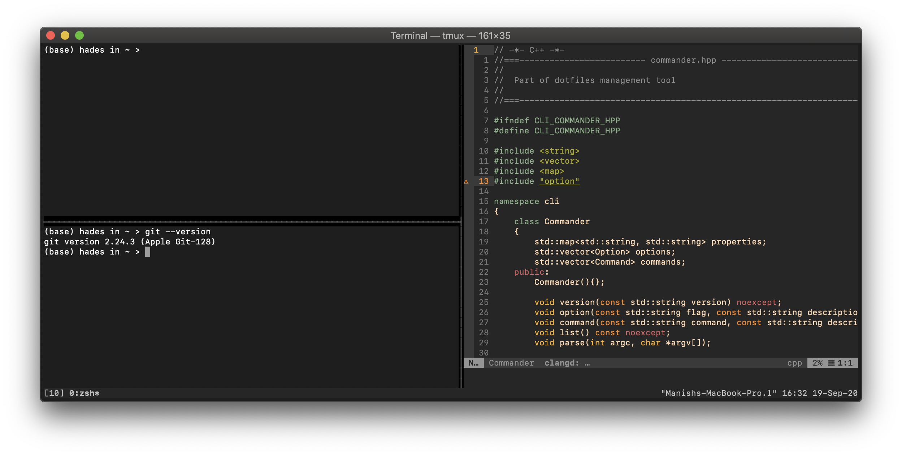

# Hades's Dotfiles 
[](https://lbesson.mit-license.org/)


Hades is my laptop, this repository is the collection of configurations that I learned over time. 

This repository is mainly applies to Unix based systems and contributions are more then welcome, feel free to reach me out at [rec.manish.sahani@gmail.com](mailto:rec.manish.sahani@gmail.com).
    
## Tooling is hard! and necessary

I have covered all the configurations in a detailed tutorial, If you like to read more about step by step configuration, please see the docs folder or visit [http://noexcept.me/dotfiles]().

just to show you the gist of what this repository will achieve, below is how the terminal looks after installation. 


### Usage 

If you want to give this a try, first fork the repository, **review the files and code** and **remove code that you don't need**. 

:warning: | Don't blindly use these settings unless you know what that entails.
:---: | :---

If you are unsure about any configuration see the tutorial under the docs folder.

```bash 
# Clone the repositry  
git clone https://github.com/manishsahani999/dotfiles.git

# Using Github cli 
gh repo clone manishsahani999/dotfiles
```

### Detailed Installtion 

See the tutorial under `docs`, and follow the steps (follow only of your need).

### Quick Installation 

The system must support basic languages (has `xcode--select`) and have `brew` installed. If you don't have these things see the `docs` for help. 

```bash
# Install xcode-select (if not present)
xcode-select --install

# Install brew (if not present)
/bin/bash -c "$(curl -fsSL https://raw.githubusercontent.com/Homebrew/install/master/install.sh)
```

### Feedback 

Suggestions / Improvements or any other helpful trick is always welcome, please drop a mail at [rec.manish.sahani@gmail.com](mailto:rec.manish.sahani@gmail.com).

### Author

 <a href="https://github.com/manishsahani999"></a>